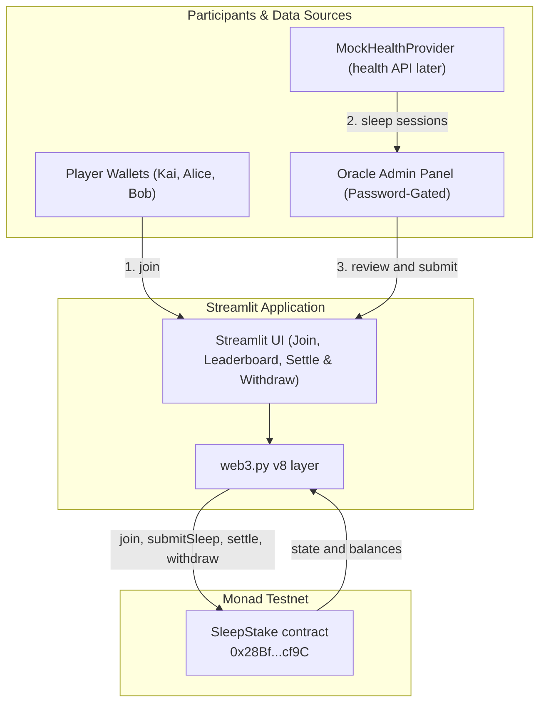

# SleepStake

A "bet on yourself" sleep challenge on Monad.

Players lock a buy-in into a smart contract and commit to a healthy nightly sleep routine. Winners who hit their sleep targets every night split the forfeited stakes of those who miss.

---

## Problem

Many adults regularly sleep less than they should (TODO: source for a specific figure). Most habit-tracking and health apps rely on passive reminders without meaningful accountability. SleepStake introduces real onchain economic incentives: bet on your own sleep discipline, build healthy habits, and earn rewards from competitors who fail.

---

## How It Works

All challenge rules and settlement calculations are strictly enforced onchain by the `SleepStake` smart contract:

1. **Nightly Sleep Window**: Sleep must start and end between **21:00 and 06:00** local time (9-hour window).
2. **Target Duration**: Sleep duration must be between **7h30 (27,000 s) and 8h30 (30,600 s)** inclusive.
3. **Winning Condition**: A player must pass **every** night of the challenge. Any night that is not reported before time expiry is treated as a failed night.
4. **Settlement & Payouts**:
   - **Nobody wins or everyone wins**: 100% full refund of original buy-ins. Zero platform fee is taken.
   - **Some win, some lose**: Losers' stakes form the forfeited pool. A **5% platform fee** is taken exclusively from the forfeited pool (never from winners' own stakes). Winners receive their full buy-in back plus an equal split of the remaining forfeited pool.
   - **Rounding Dust**: Any indivisible remainder wei from integer division is credited to the treasury.
   - **Conservation Invariant**: `sum(claimable) == total buy-ins == contract balance` down to the exact wei.
5. **Pull-Payment Pattern**: Rewards and refunds are credited to `claimable` balances. Players and the treasury withdraw their funds via `withdraw()`.

---

## Architecture



---

## Trust Model & Future Work

- **Today (Hackathon Demo)**: A dedicated, separate **oracle wallet** submits sleep start and end timestamps to the contract. The contract autonomously evaluates window bounds, duration limits, and payout math.
- **Roadmap (Trustless Health Oracle)**: Integration with a health API such as Google Health. Sleep data would be cryptographically signed at the source (or proven with techniques like zkTLS), enabling players to submit their own proofs without trusting any centralized oracle.

---

## Deployed Contract

- **Network**: Monad Testnet (Chain ID `10143`)
- **Contract Address**: [`0x28BfDC4310Ca8c0fdE6D2dE1E98Faa66a8e2cf9C`](https://testnet.monadvision.com/address/0x28BfDC4310Ca8c0fdE6D2dE1E98Faa66a8e2cf9C)

---

## Live Demo

- **Streamlit App**: https://sleepstake-intjg3laogz4rind9anvsp.streamlit.app

---

## Local Setup & Run

### Prerequisites
- Foundry 1.8+ (`forge`, `cast`)
- Python 3.12+ (tested with Python 3.13)

### 1. Clone Repository
```bash
git clone --recurse-submodules https://github.com/fluyid/sleepstake.git
cd sleepstake
```

### 2. Run Smart Contract Tests
```bash
forge test -vv
```

### 3. Setup Python Virtual Environment
```bash
python3 -m venv .venv
source .venv/bin/activate
pip install -r requirements.txt
```

### 4. Configure Environment
```bash
cp .env.example .env
# Edit .env with your Monad testnet RPC, deployed contract address, and demo keys
```

### 5. Launch Streamlit App
```bash
streamlit run app/streamlit_app.py
```

---

## Security & Best Practices

- **Honest limitation**: the oracle is trusted today. Unreported nights count as fails, so an offline oracle hurts players; signed health data is the fix on the roadmap.

- **Role Separation**: Dedicated throwaway oracle wallet for submitting sleep reports; treasury and deployer permissions remain isolated.
- **Pull Payments**: No native token transfers inside loops. Funds are credited to `claimable` balances and withdrawn individually via `withdraw()`.
- **Checks-Effects-Interactions**: Zeroing claimable balances prior to external calls prevents reentrancy. Challenge marked as `settled = true` before balance distribution.
- **Bounded Loops**: Challenges are capped at 50 players (`MAX_PLAYERS = 50`) to avoid block gas limit issues during settlement.
- **Tested Math**: 16 Foundry tests covering window edge cases, exact boundary limits (7h30 and 8h30), access controls, and strict wei-level balance conservation.